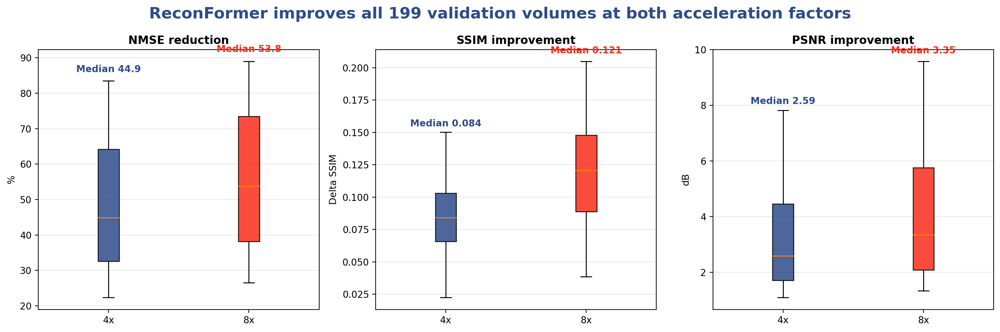

# ReconFormer fastMRI Inference Replication

Independent inference replication of
[ReconFormer: Accelerated MRI Reconstruction Using Recurrent Transformer](https://arxiv.org/abs/2201.09376)
on the complete fastMRI single-coil proton-density knee validation set.

This repository evaluates the official pretrained ReconFormer checkpoints at
4x and 8x acceleration. It includes volume-level evaluation, zero-filled
baselines, paired statistical analysis and reproducible experiment scripts.

> This project reproduces inference using official pretrained weights. It does
> not reproduce model training from scratch.

## Main Results

All 199 fastMRI validation volumes completed successfully.

| Acceleration | Method | NMSE ↓ | SSIM ↑ | PSNR ↑ |
|---|---|---:|---:|---:|
| 4x | Zero-filled | 0.05266 | 0.65495 | 29.50 dB |
| 4x | ReconFormer | **0.03099** | **0.73834** | **32.73 dB** |
| 8x | Zero-filled | 0.08892 | 0.55054 | 26.84 dB |
| 8x | ReconFormer | **0.04286** | **0.66969** | **30.89 dB** |

At 8x acceleration, the reproduced SSIM of **0.66969** and PSNR of
**30.891 dB** match the reported values of 0.6697 and 30.89 dB after
rounding.

ReconFormer improved NMSE, SSIM and PSNR for **199/199 volumes** at both
acceleration factors.



## Volume-Level Analysis

Median improvement over zero-filled reconstruction:

| Acceleration | NMSE reduction | SSIM improvement | PSNR improvement |
|---|---:|---:|---:|
| 4x | 44.93% | +0.08403 | +2.591 dB |
| 8x | 53.77% | +0.12076 | +3.351 dB |

Paired one-sided Wilcoxon signed-rank tests gave `p = 1.047e-34` for NMSE,
SSIM and PSNR at both acceleration factors.

## Repository Structure

```text
.
├── data/                         # fastMRI loading and transforms
├── models/                       # ReconFormer model and evaluation code
├── utils/                        # options, metrics and SSIM utilities
├── scripts/
│   ├── evaluate_all_volumes_x4.py
│   ├── evaluate_all_volumes_x8.py
│   ├── parse_volume_metrics.py
│   └── analyze_volume_results.py
├── results/
│   ├── x4_per_volume_metrics.csv
│   ├── x8_per_volume_metrics.csv
│   ├── x4_summary.txt
│   ├── x8_summary.txt
│   └── figures/
├── main_recon.py
├── main_recon_test.py
├── environment.yml
└── requirements.txt
```

## Data and Checkpoints

Download the fastMRI single-coil proton-density validation data separately.
Dataset files and pretrained weights are not redistributed in this repository.

Expected structure:

```text
datasets/
└── fastMRI/
    └── PD/
        └── val/
            ├── file1000000.h5
            └── ...

checkpoints/
├── F_X4_checkpoint.pth
└── F_X8_checkpoint.pth
```

Obtain the official checkpoints from the
[original ReconFormer repository](https://github.com/guopengf/ReconFormer).

## Environment

The experiments used Python 3.8, PyTorch 1.8.1 and CUDA 11.1.

```bash
conda env create -f environment.yml
conda activate reconformer
```

Before evaluation, restrict OpenMP and MKL thread counts:

```bash
export OMP_NUM_THREADS=1
export MKL_NUM_THREADS=1
```

## Run 4x Evaluation

The 4x experiment uses acceleration 4 and centre fraction 0.08.

```bash
python scripts/evaluate_all_volumes_x4.py
```

## Run 8x Evaluation

The 8x experiment uses acceleration 8 and centre fraction 0.04.

```bash
python scripts/evaluate_all_volumes_x8.py
```

Each script processes one volume at a time, records a separate log and supports
resuming from completed volumes.

## Parse Corrected Metrics

The original console output contains both zero-filled and ReconFormer metrics.
Use the parser to extract both sets separately:

```bash
python scripts/parse_volume_metrics.py results/final_199_x4
python scripts/parse_volume_metrics.py results/final_199_x8
```

This produces:

```text
zero_filled_vs_reconformer.csv
summary_corrected.txt
```

## Reproduce the Statistical Analysis

```bash
python scripts/analyze_volume_results.py
```

The script verifies that the 4x and 8x CSV files contain the same 199 volumes,
runs paired Wilcoxon signed-rank tests and creates the consistency figure.

## Reproduction Modifications

The official implementation required several compatibility and evaluation
changes:

- Converted complex NumPy arrays into real and imaginary PyTorch channels.
- Updated evaluation batch unpacking for the current dataset output.
- Moved masks and k-space tensors to the selected device.
- Added one-volume-at-a-time evaluation to control memory use.
- Added resumable evaluation with per-volume logs.
- Separated zero-filled and ReconFormer metric parsing.
- Added paired volume-level statistical analysis.

## Limitations

- The project uses official pretrained checkpoints.
- Training was not reproduced from scratch.
- Evaluation is limited to the fastMRI single-coil PD validation set.
- NMSE, SSIM and PSNR do not establish clinical diagnostic safety.
- Runtime and memory use may vary across hardware and software versions.

## Acknowledgements

This repository is based on the official ReconFormer implementation by Guo et
al. The original authors retain credit for the model architecture and
pretrained weights.

## Citation

```bibtex
@article{guo2022reconformer,
  title={ReconFormer: Accelerated MRI Reconstruction Using Recurrent Transformer},
  author={Guo, Pengfei and Mei, Yiqun and Zhou, Jinyuan and Jiang, Shanshan
          and Patel, Vishal M.},
  journal={arXiv preprint arXiv:2201.09376},
  year={2022}
}
```
